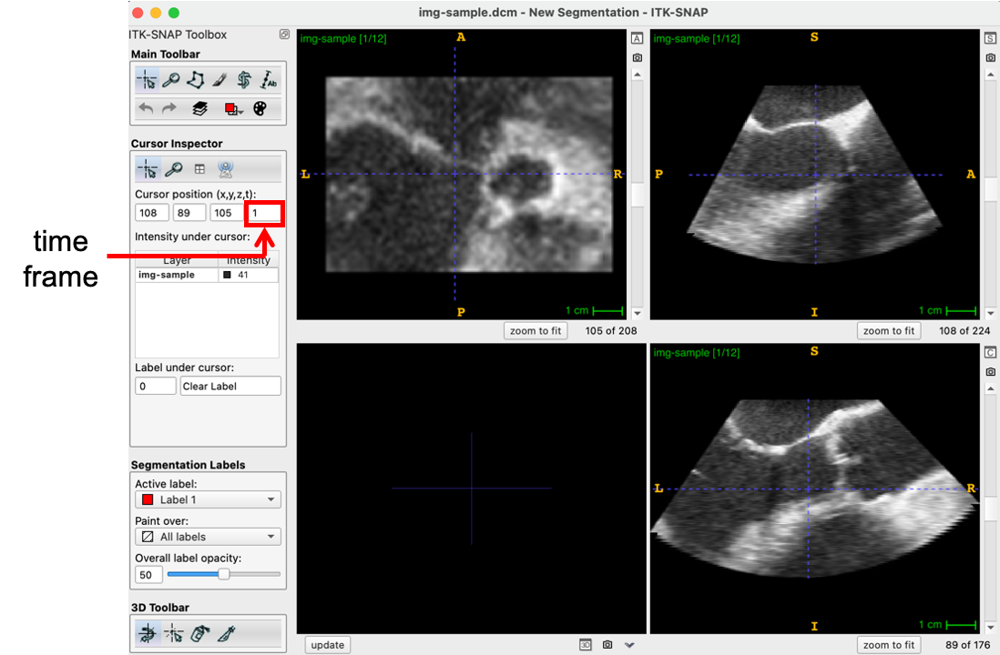
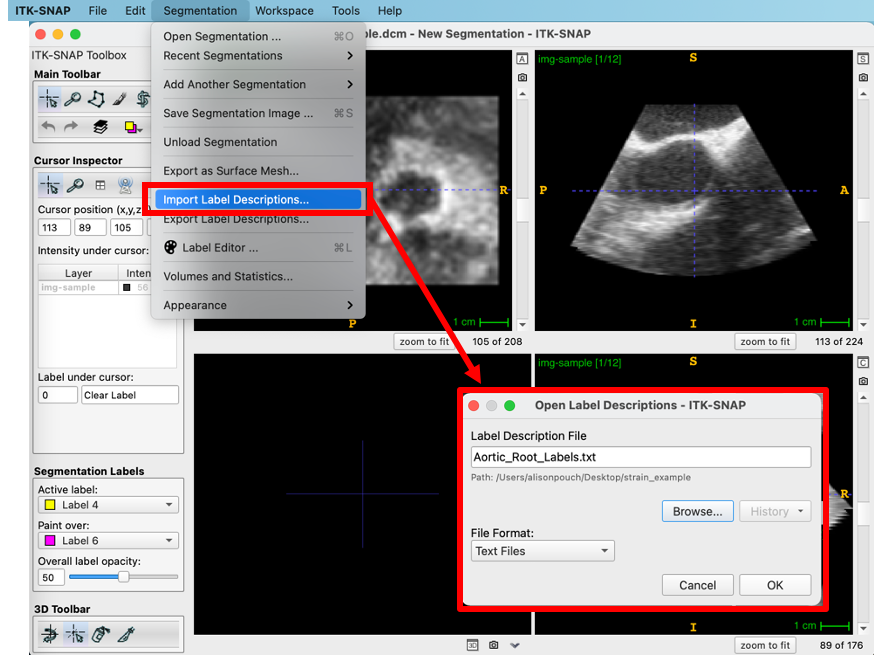
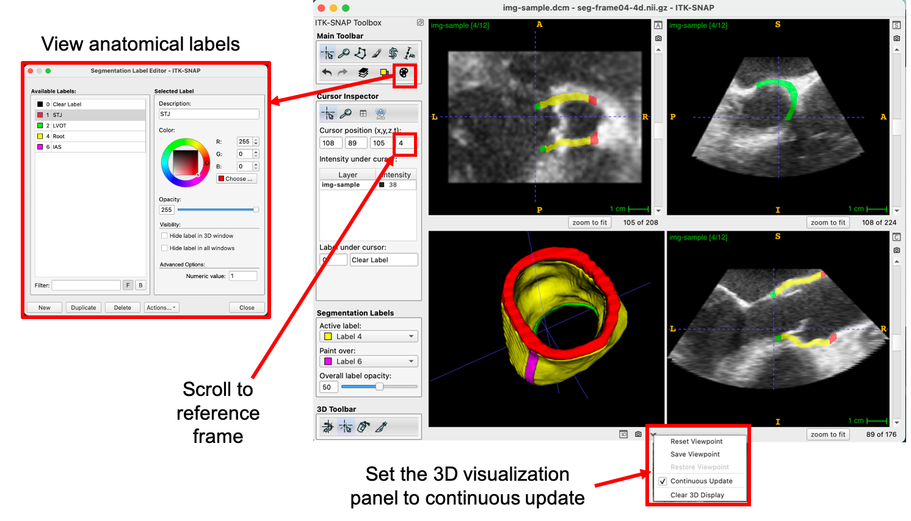
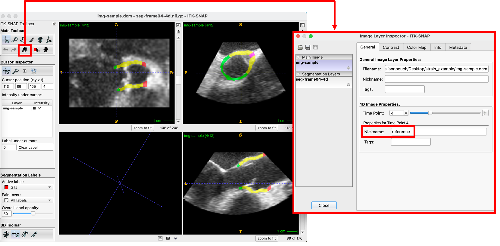
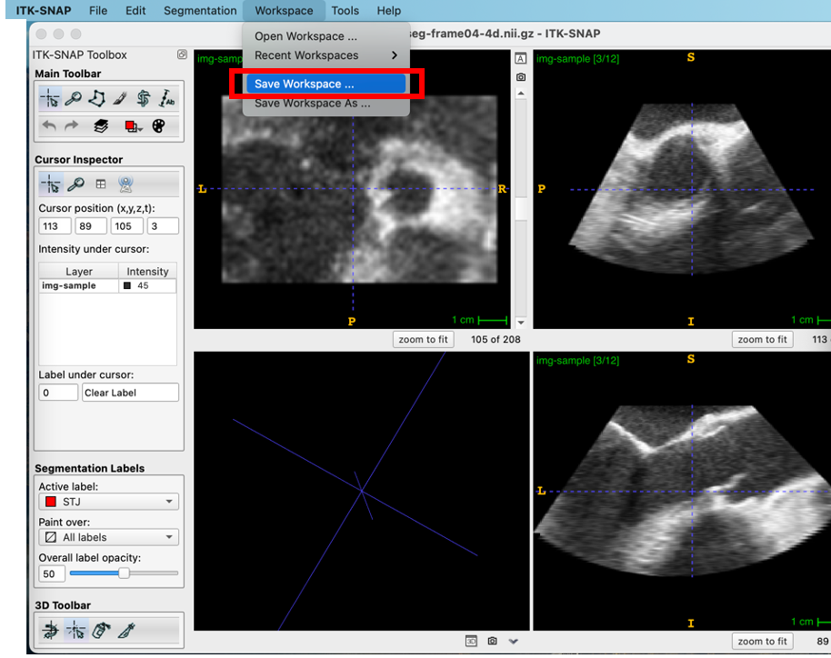
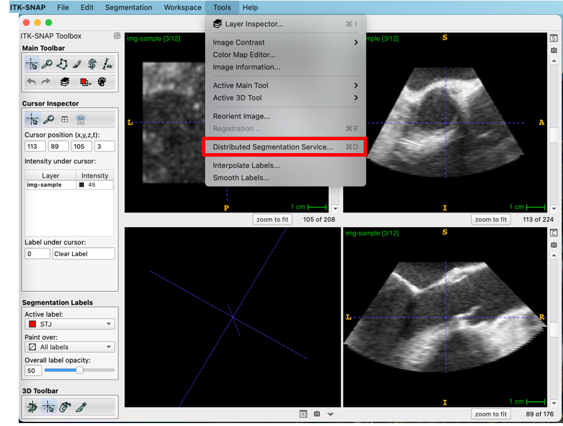
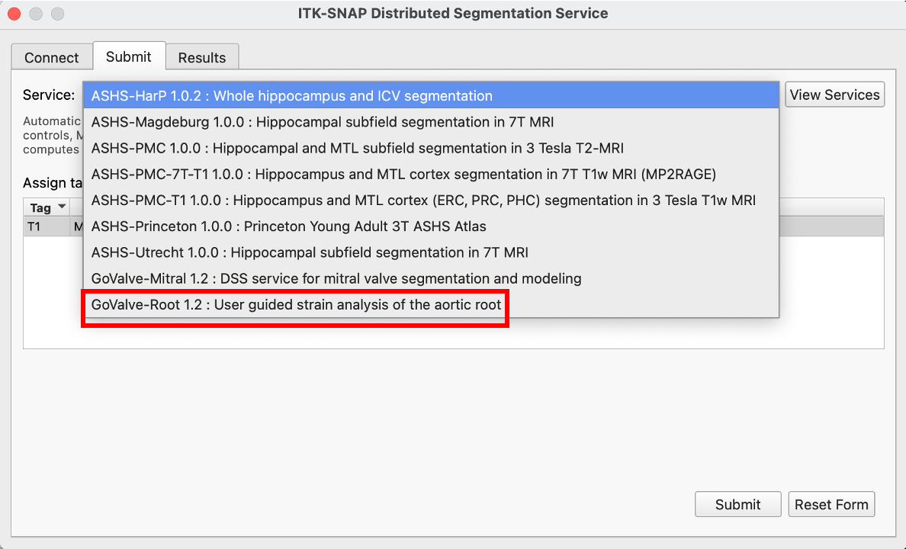
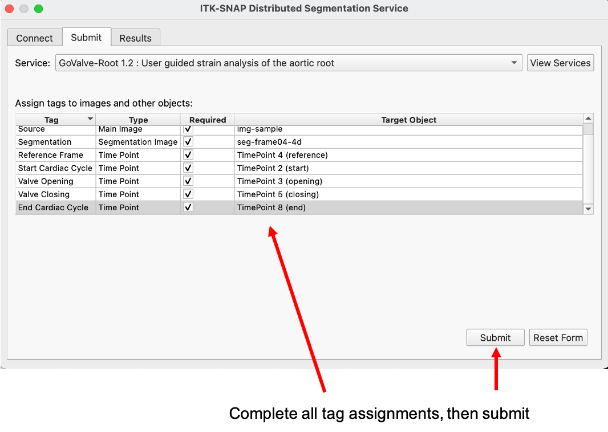
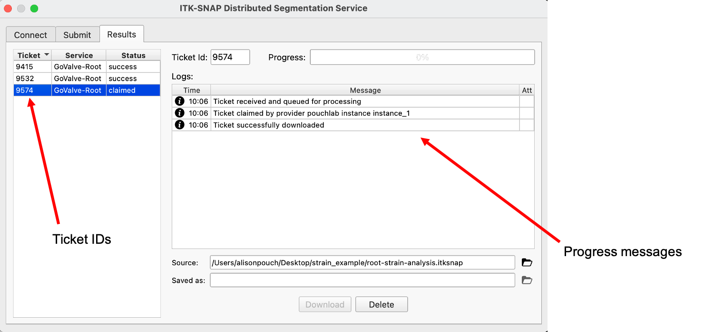

.. GoValve-Root documentation master file, created by
   sphinx-quickstart on Thu Nov  4 16:08:12 2021.
   You can adapt this file completely to your liking, but it should at least
   contain the root `toctree` directive.

GoValve-Root Documentation
==========================

**GoValve-Root** is an ITK-SNAP distributed segmentation service that computes aortic root
strain over the cardiac cycle from a 4D image series.

.. toctree::
   :maxdepth: 2
   :caption: Contents:

Prerequisites
=============
* ITK-SNAP `<itksnap.org>` version 4.0 or later. `Note that earlier versions of ITK-SNAP do not handle 4D segmentations.`
* User account registration at `<https://dss.itksnap.org>`.

Distributed Segmentation Service (DSS) Overview
===============================================
As with any DSS implemented in ITK-SNAP, the GoValve-Root service involves three layers of communication:

**client**
  The user loads a 4D image of the aortic root in the ITK-SNAP GUI (version 4.0 or later), creates a 3D segmentation of the aortic root in a "reference frame" (a single 3D image volume in the 4D series), and tags relevant time frames in the cardiac cycle. This creates a `workspace` that serves as input to the strain analysis algorithm.

**middleware**
  The ITK-SNAP workspace created by the client is submitted to the ITK-SNAP DSS middleware layer, which orchestrates communication between the client and the service provider that carries out the image analysis algorithm. The main production DSS middleware runs at https://dss.itksnap.org. The user must create an account and sign into dss.itksnap.org before submitting an image for segmentation and strain analysis.

**service**
  The remote server that runs the strain analysis algorithm receives the de-identified image from the DSS middleware layer and returns the output 4D aortic root segmentation, mesh series, and strain information.

.. warning:: At the present, DSS is intended for processing of small batches of datasets. In the future, we envision extending this system to use cloud-based computing resources with the ability to pass the computational costs to end-users.  

TUTORIAL
========

Algorithm Overview
------------------
The (client-side) instructions for providing the input to the algorithm involve three main steps:
* Loading a 4D image and standard label annotation file
* Creating a 3D reference segmentation of the aortic root
* Annotating time frames in the cardiac cycle

In this tutorial, we will generate a 4D segmentation of the aortic root in one cardiac cycle in echocardiography. 

Load Sample Image and Annotation File
-------------------------------------
A Cartesian DICOM file can be obtained from the ITK-SNAP download page [here]. The image can be loaded into ITK-SNAP by simply dragging and dropping the file into the program or by navigating to the file (File -> Open Main Image...). Once loaded, the user can scroll through different time frames of the 4D image series on the sidebar, as noted below.

The standardized annotation text file "Aortic_Root_Labels.txt" (also on the ITK-SNAP download page) is loaded by navigating to Segmentation -> Import Label Descriptions. The file assigns text and a color to each anatomical component: the aortic root, interatrial septum (IAS), sinotubular junction (STJ), and left ventricular outlet (LVOT). This file should always be used with this pipeline as it assigns consistent integer labels to the anatomical components represented in the segmentation.

Generate (or Load) a Reference Segmentation
-------------------------------------------
The user selects and navigates to a "reference" time frame for which a segmentation of the aortic root will be generated. In this case, we choose the 4th time frame and load an existing segmentation of the aortic root (available on the ITK-SNAP download page). As shown below, the Label Editor can be used to view the label descriptions and the segmentation can be set to "Continuous Update" (arrow at the bottom of the 3D visualization panel). 

Annotate the Time Frames
------------------------
Using the layer inspector, the user can assign a "Nickname" to each frame number of interest. The five time frames that need to be annotated in this pipeline include:

1. Reference frame (frame number of the reference 3D segmentation)
2. Start of the cardiac cycle
3. Aortic valve opening
4. Aortic valve closing
5. End of the cardiac cycle

Annotation of the reference frame in the label inspector is shown below. The other four frames are similarly assigned a nickname.

Save the Workspace
------------------

Finally, the user saves the workspace, which contains the image and segmentation filenames, the root labels, and time annotations. Note that once saved, this workspace can be opened at a later time and it will automatically load the image, segmentation, and annotations.

Submit a Ticket
---------------

The user selects `Distributed Segmentation Service...` from the Tools menu.

After logging into the DSS site, the GoValve-Root pipeline is selected in the Submit drop-down menu.

The user completes an entry for each of the algorithm inputs: the main image, segmentation, and five time frames. Then the workspace is submitted.

The submission will be assigned a Ticket (left side of the Results menu) and the user will be notified when the ticket is downloaded. Note that processing may take a while depending on the image size and number of frames in the cardiac cycle!

Once finished, the ticket is downloaded and the user can view the 4D segmentation result by scrolling through the time frames of the cardiac cycle.

Note that there are attachments included with the returned ticket, including a Summary PDF file with graphs of the strain assessment, as well as VTP mesh files that can be loaded into a program such as Paraview in order to visualize strain on the 3D mesh. 

Acknowledgements
================
This pipeline was developed as a collaboration between the Penn Image Computing and Science Laboratory & Aggarwal Laboratory at the University of Glasgow.
Funding was provided by the Chan Zuckerberg Initiative for Essential Open Source Software for Science.

Contributors: 
Ankush Aggarwal, Ph.D.
Jilei Hao, M.S.
Peter Mortensen, Ph.D.
Alison Pouch, Ph.D.

Many thanks to Dr. Paul Yushkevich for building the foundation for ITK-SNAP distributed segmentation services!

